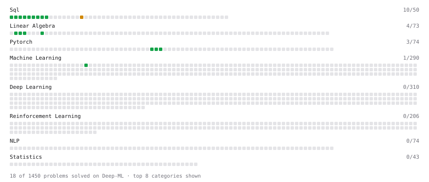

# Deep-ML

My machine learning practice from [Deep-ML](https://www.deep-ml.com). Every solution here was written by hand.

**19** solved · 17 problems · 0 labs · 2 math

[**Browse the interactive portfolio**](https://Aakashi06.github.io/deep-ml/) to replay this filling in over time.

## Problems

| | Difficulty | Solved | |
| --- | --- | --- | --- |
| [Average per group](https://www.deep-ml.com/problems/1108) | easy | 2026-07-21 | [solution](problems/1108-average-per-group) |
| [Calculate Mean by Row or Column](https://www.deep-ml.com/problems/4) | easy | 2026-09-27 | [solution](problems/0004-calculate-mean-by-row-or-column) |
| [Count rows per group](https://www.deep-ml.com/problems/1107) | easy | 2026-07-21 | [solution](problems/1107-count-rows-per-group) |
| [Create and Inspect a Tensor](https://www.deep-ml.com/problems/1220) | easy | 2026-08-07 | [solution](problems/1220-create-and-inspect-a-tensor) |
| [Filter rows with WHERE](https://www.deep-ml.com/problems/1103) | easy | 2026-07-21 | [solution](problems/1103-filter-rows-with-where) |
| [Gradient of a Square with Autograd](https://www.deep-ml.com/problems/1222) | easy | 2026-08-09 | [solution](problems/1222-gradient-of-a-square-with-autograd) |
| [Linear Kernel Function](https://www.deep-ml.com/problems/45) | easy | 2026-09-27 | [solution](problems/0045-linear-kernel-function) |
| [Remove duplicates with DISTINCT](https://www.deep-ml.com/problems/1105) | easy | 2026-07-21 | [solution](problems/1105-remove-duplicates-with-distinct) |
| [Reshape and Transpose a Tensor](https://www.deep-ml.com/problems/1221) | easy | 2026-08-07 | [solution](problems/1221-reshape-and-transpose-a-tensor) |
| [Reshape Matrix](https://www.deep-ml.com/problems/3) | easy | 2026-04-06 | [solution](problems/0003-reshape-matrix) |
| [SELECT all rows](https://www.deep-ml.com/problems/1101) | easy | 2026-07-21 | [solution](problems/1101-select-all-rows) |
| [Select specific columns](https://www.deep-ml.com/problems/1102) | easy | 2026-07-21 | [solution](problems/1102-select-specific-columns) |
| [Sort results with ORDER BY](https://www.deep-ml.com/problems/1104) | easy | 2026-07-21 | [solution](problems/1104-sort-results-with-order-by) |
| [Top N with LIMIT](https://www.deep-ml.com/problems/1106) | easy | 2026-07-21 | [solution](problems/1106-top-n-with-limit) |
| [Transpose of a Matrix](https://www.deep-ml.com/problems/2) | easy | 2026-04-06 | [solution](problems/0002-transpose-of-a-matrix) |
| [Your first JOIN](https://www.deep-ml.com/problems/1109) | easy | 2026-07-21 | [solution](problems/1109-your-first-join) |
| [Values Appearing Three or More Times Consecutively](https://www.deep-ml.com/problems/1117) | medium | 2026-08-09 | [solution](problems/1117-values-appearing-three-or-more-times-consecutively) |

## Math

| | Difficulty | Solved | |
| --- | --- | --- | --- |
| [Derivatives and Gradients](https://www.deep-ml.com/math-problems/1) | easy | 2026-08-07 | [solution](math/0001-derivatives-and-gradients) |
| [Gradient Descent Updates](https://www.deep-ml.com/math-problems/5) | easy | 2026-08-07 | [solution](math/0005-gradient-descent-updates) |

---

_This file is regenerated by Deep-ML on every push._
